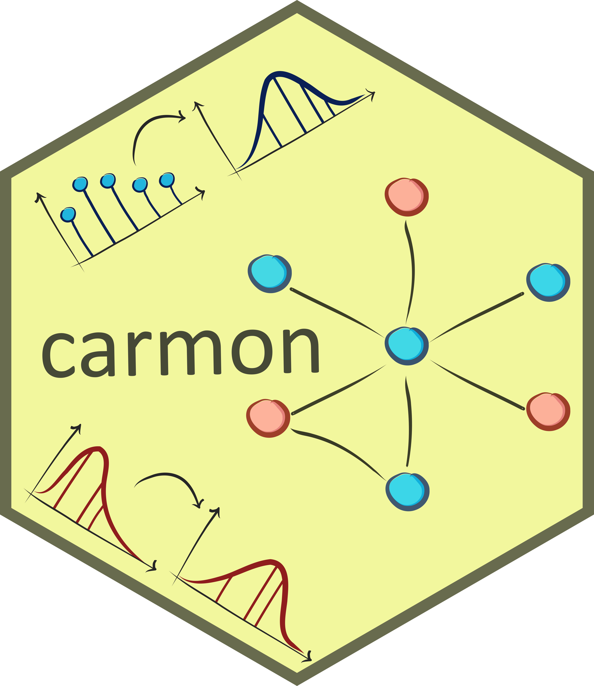

<!-- README.md is generated from README.Rmd. Please edit that file -->

```{r, include = FALSE}
knitr::opts_chunk$set(
    collapse = TRUE,
    comment = "#>",
    fig.path = "man/figures/README-",
    out.width = "100%"
)
```

# carmon - Copula Aided Reconstruction of Multi-Omics Networks <a href="https://drquestion.github.io/carmon/"></a>


<!-- badges: start -->
[](https://lifecycle.r-lib.org/articles/stages.html#experimental)
[](https://bioconductor.org/checkResults/release/bioc-LATEST/carmon)
[](https://bioconductor.org/checkResults/devel/bioc-LATEST/carmon)
[](http://bioconductor.org/packages/stats/bioc/carmon/)
[](https://support.bioconductor.org/tag/carmon)
[](https://bioconductor.org/packages/release/bioc/html/carmon.html#since)
[](http://bioconductor.org/checkResults/devel/bioc-LATEST/carmon/)
[](https://bioconductor.org/packages/release/bioc/html/carmon.html#since)
[](https://github.com/DrQuestion/carmon/actions/workflows/R-CMD-check.yaml)
[](https://github.com/DrQuestion/carmon/actions/workflows/check-bioc.yml)
[](https://app.codecov.io/gh/DrQuestion/carmon)
<!-- badges: end -->

Carmon uses copula-based approaches to reconstruct multi-omics networks. Copulas
allow to maximize the use of the information contained in non-normalized raw 
omics data, creating a mirror image in the normal realm for each variable of 
every omics layer. Carmon then uses these "mirror" normal variables to 
reconstruct the multi-omics network.

## Installation

You can install carmon from [Bioconductor](https://bioconductor.org/) with:

``` {r, eval=FALSE}
if (!require("BiocManager", quietly = TRUE))
    install.packages("BiocManager")

BiocManager::install("carmon")
```

Alternatively, you can install the *development* version from 
[GitHub](https://github.com/). First, make sure to install devtools with:

``` {r, eval=FALSE}
if (!require("devtools")) {
  install.packages("devtools")
}
```

You can then install the development version with:

``` {r, eval=FALSE}
devtools::install_github("DrQuestion/carmon")
```

## Usage

Here is an example of the typical usage of `carmon` to reconstruct a multi-omics 
network. For a more customized use of the package, please see 
`vignette("carmon")`. The main function of the package is `carmon()`, a single 
wrapping function encompassing all the modules of the package. When the input 
data are properly formatted, `carmon()` only needs them as a mandatory argument.
They should be preferably provided in the form of a named R list, with each 
element being the data set of an omics layer, named in the R list after the 
omics type it contains. The available omics types for which `carmon` has been 
specifically tailored, together with their accepted synonyms, are shown by the
function `which_omics()`. The package expects every omics layer to be perfectly
source-matched. This means that every variable of every omics layer must have 
been measured for the same individual/sample/observation/replicate. The 
package provides a few examples of multi-omics data sets formatted according to 
`carmon`'s standard. In this example we use the small data set already provided
by the package, `multi_omics_small`. 

``` {r, eval = FALSE}
# Attaching the package
library(carmon)

# Loading the carmon-formatted multi-omics data set
data(multi_omics_small)

# Displaying the structure of the named R list
str(multi_omics_small)
```

You can see that the data set has two layers, a transcriptomic layer named 
`rnaseq` in the list, and a metabolomic layer named `metabolomics`. This shows 
also that both layers have been measured over (the same) 30 observations, and 
how of they measure, respectively, the transcript counts of 14 genes and the 
concentrations of 5 metabolites. When the input is properly formatted, it is 
possible to just run the function `carmon()` on it, relying on its default 
behaviour.


```{r example, eval=FALSE}
carmon_obj <- carmon(multi_omics_small)
```

This single call covers all functional modules of the package. To see an example
of how to properly format your input data, an explanation of each functional 
module of the package that acts under the hood of the main function `carmon()`, 
and examples of more customized behaviours, please see `vignette("carmon")`. 

Among the functional modules, one performs a centrality analysis based on a 
consensus of multiple centrality measures to highlight key nodes of the network.
These nodes are candidates that could have an important function in the 
biological process you are studying.
The report generated by the network analysis can be accessed via:

```{r report, eval=FALSE}
centrality_report(carmon_obj)
```

The report table contains the nodes that resulted to be central in the analysis,
according to four different measures of centrality: degree (`d`), betwenness 
(`b`), closeness (`c`), and eigenvector (`e`) centrality. Names that result 
central according to more than one measure are reported on top of the table, 
and the last column contains the first letter(s) of the measure(s) according to
which they resulted to be central. In our interpretation, the more measures 
label a node as central, the more important this node is in the network.

## Contributing
The `carmon` package is built to grow. In particular, we intend to expand it to
new omics types and relative marginal distributions. If you wish for your 
favourite omics layer to be included, please feel free to issue a feature 
request on the \href{https://github.com/DrQuestion/carmon}{GitHub repository}, 
or to directly contribute following the instructions in the `CONTRIBUTING.md` 
file.

## Code of Conduct
  Please note that the carmon project is released with a [Contributor Code of Conduct](http://bioconductor.org/about/code-of-conduct/). By contributing to 
  this project, you agree to abide by its terms.
